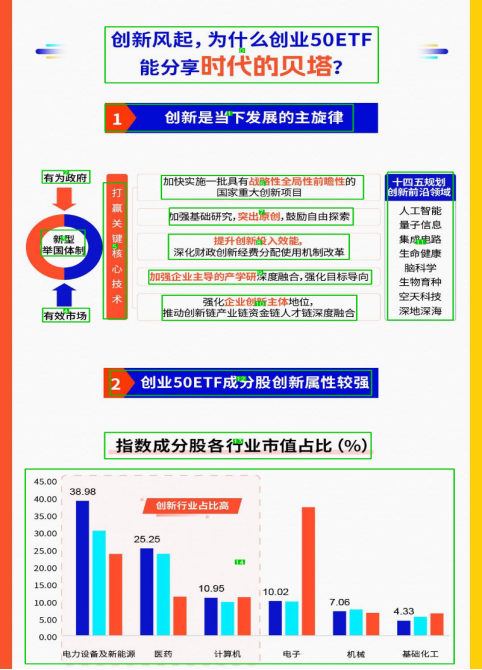
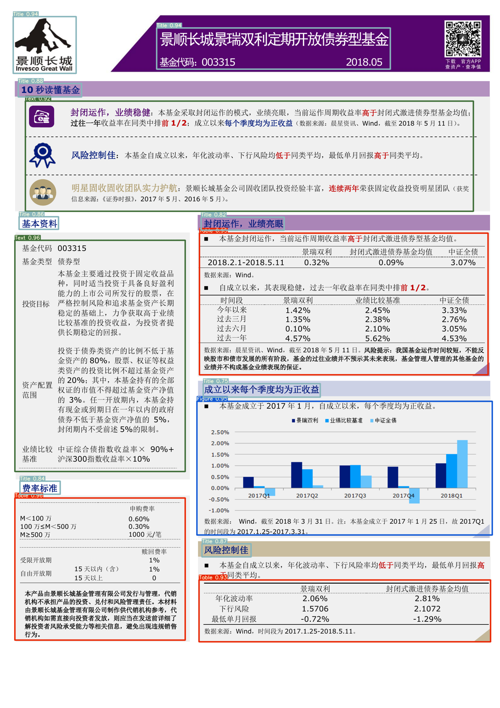

# 通用文档版面分析 | General Document Layout Analysis

---
**Read this in other languages: [English](README.md), [中文](README_zh.md).**

## 1 Introduction：

The goal of this project is to provide a universal document layout analysis model. Layout analysis plays a crucial role in addressing the issue of text fragment merging in document parsing using OCR. For instance, in the case of double-column text, OCR recognition may result in disordered sequences due to improper post-processing. Text disarray can significantly impact subsequent applications such as large-scale model parsing. This project can be utilized to address challenges in scanning PDF parsing, image parsing, and similar scenarios.

While there are numerous open-source OCR projects and sorting models like xy_cut, this project currently does not incorporate the sorting module.

**The model framework is YOLOv5, and it employs a two-stage training approach:**

* Stage One: Based on open-source datasets from scientific papers, news articles, and other domains. The goal is to make the model adapt to document layout and extract general features of various elements such as images, text, and tables.

* Stage Two: Constructing a more diverse annotated dataset for domain-specific documents. This involves collecting images of complex document layouts, utilizing the Stage One model for pre-labeling, and subsequently adjusting the annotations manually using label-studio.

**Note:**

1. Supports three types of layout elements: [Text block, Image, Table].

This project simplifies redundant elements such as formulas, headers, and footers, as they are not crucial for the accurate reconstruction of document text content.

2. For elements of the 'Table' type, you can integrate third-party custom models such as 'table_parser.' This allows you to extract table images, input them into a table parsing model, and obtain structured table outputs.
## 2 Inference

1、Single Image Inference: `python infer.py` 

2、Batch Inference: `python3 detect.py --source ./inference/images/ --weights weights/layout.pt --conf 0.5 --device cpu`

Weight Download. The weights primarily include two parts:

1、yolov5x：Link：https://pan.baidu.com/s/19PxE7iWRYhD2FSGln8960g 
code：4j3l

2、Layout：Link：https://pan.baidu.com/s/1HoERqJgErZR0p0-8ogA5Tg 
code：fveg

## 3 Training

`sh train.sh`

Parameter Explanation and Notes:

1、`--data data/layout.yaml`

Before training, please ensure that your data is configured correctly. The configuration file is located at data/layout.yaml. If you need to change supported types, modify the corresponding configuration file. The training data should be in YOLO data format.

2、`--cfg models/score/yolov5x.yaml`

Configuration File: If the number of types changes, please make sure to update the 'nc' (number of classes) in the configuration file accordingly.

## 4 examples:

## 5 End
This project is developed based on the following projects. Thanks to the original authors and the original YOLO contributors.
https://github.com/DataXujing/YOLO-v5

